Android虚拟机原理03（虚拟机执行内存与回收）

> **码牛学院用代码码出自己牛逼的人生**


1.java自动管理堆（heap）和（栈），程序员不能直接的设置堆和栈。

3.操作系统的堆和栈：

> - 堆（操作系统）：一般由程序员分配释放，若程序员不释放，程序结束时可能由OS回收，分配方式类似于链表。
>
> - 栈（操作系统）：由操作系统自动分配释放，存放函数的参数值，局部变量值等。操作方式与数据结构中的栈相类似。
>

##### 1. 2.为什么Android虚拟机的内存是分布在操作系统的堆中呢？？

​			因为操作系统的栈是操作系统管理的，它随时会被回收，所以如果jvm放在栈中，那java的一个null对象就很难确定会被谁回收了，那gc的存在就一点意义都莫有了，而要对栈做到自动释放也是jvm需要考虑的，所以放在堆中就最合适不过了。

 


上图表明：jvm虚拟机位于操作系统的堆中，并且，程序员写好的类加载到虚拟机执行的过程是：当一个classLoder启动的时候，classLoader的生存地点在jvm中的堆，然后它会去主机硬盘上将A.class装载到jvm的方法区，方法区中的这个字节文件会被虚拟机拿来new A字节码()，然后在堆内存生成了一个A字节码的对象，然后A字节码这个内存文件有两个引用一个指向A的class对象，一个指向加载自己的classLoader，

5，java虚拟机的生命周期：声明周期起点是当一个java应用main函数启动时虚拟机也同时被启动，而只有当在虚拟机实例中的所有非守护进程都结束时，java虚拟机实例才结束生命。

6，java虚拟机与main方法的关系：main函数就是一个java应用的入口，main函数被执行时，java虚拟机就启动了。启动了几个main函数就启动了几个java应用，同时也启动了几个java的虚拟机。

7，java的虚拟机种有两种线程，一种叫叫守护线程，一种叫非守护线程（也叫普通线程），main函数就是个非守护线程，虚拟机的gc就是一个守护线程。java的虚拟机中，只要有任何非守护线程还没有结束，java虚拟机的实例都不会退出，所以即使main函数这个非守护线程退出，但是由于在main函数中启动的匿名线程也是非守护线程，它还没有结束，所以jvm没办法退出

8，虚拟机的gc（垃圾回收机制）就是一个典型的守护线程。

9，实例理解“当所有的非守护线程全部解说，jvm声明周期才结束”：

```
public class MianAndThread{
    public static void main( String args[]){
        new Thread(new Runnable(){
                    @override
                    public void run(){
                        Thread.currendThread.sleep(5000s);
                        System.out.println("睡了5s后打印,这是出main之外的非守护线程，这个推出后这个引用结束，jvm声明周期结束。任务管理的java/javaw.exe进程结束"
                    }
        }
        System.out.println("mian线程直接打印，mian线程结束，电脑任务管理器的java/javaw.exe进程并没有结束。")
    }   
}
```

10，GC垃圾回收机制不是创建的变量为空是就被立刻回收，而是超出变量的作用域后就被自动回收。

11，程序在jvm原先的流程：

​		首先，当一个程序启动之前，它的class会被类装载器装入方法区 ，执行引擎读取方法区的字节码自适应解析，边解析就边运行（其中一种方式），然后pc寄存器指向了main函数所在位置，虚拟机开始为main函数在java栈中预留一个栈帧（每个方法都对应一个栈帧），然后开始跑main函数，main函数里的代码被执行引擎映射成本地操作系统里相应的实现，然后调用本地方法接口，本地方法运行的时候，操纵系统会为本地方法分配本地方法栈，用来储存一些临时变量，然后运行本地方法，调用操作系统APIi等等。 

12，根据Java虚拟机规范的规定，如果方法区的内存空间不能满足内存分配需要时，将抛出OutOfMemoryError异常。

13，jvm的结构图：

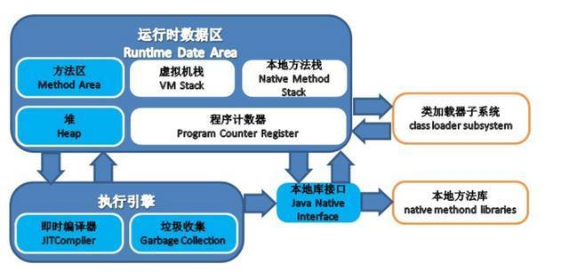

方便理解可把上图分为“功能区”和"数据区”（好好理解功能和数据的含义（一动一静））：参考下面13.1，功能区：垃圾回收系统、类加载器、执行引擎；数据区：也就是整个运行时数据区；

13.1 jvm内部执行运行流程图：

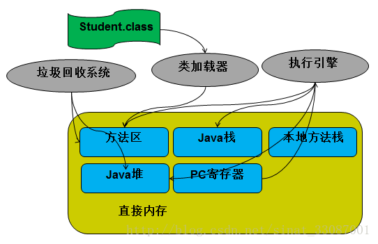

 

14，jvm结构图各模块的生命周期总结：

​		对13中的结构图，做一下统计，启动一个jvm虚拟机程序就是启动了一个进程。启动的同时就在操作系统的堆内存中开辟一块jvm内存区，对于13图中各个小模块的声明周期：

​		虚拟机栈、本地方法栈、程序计数器这三个模块是线程私有的，有多少线程就有多少个这三个模块，声明周期跟所属线程的声明周期一致。以程序计数器为例，因为多线程是通过线程轮流切换和分配执行时间来实现，所以当线程切回到正确执行位置，每个线程都有独立的程序技术器，各个线程之间的计数器互不影响，独立存储。

其余是跟JVM虚拟机的生命周期一致。

15，13图中，程序计数器模块是JVM内存区域唯一不会报outofMemoryError情况的区域。

16，结合13图，我们总结出JVM内存包含两个子系统和两个组件，两个子系统是：Classloader子系统和Executionengine(执行引擎)子系统；两个组件分别是：Runtimedataarea(运行时数据区域)组件和Nativeinterface(本地库接口)组件。

从图中可以看出运行时数据区域包含5部分：方法区，堆，虚拟机栈，本地方法栈，程序计数器

17，什么是本地库接口和本地方法库：（1）本地方法库接口：即操作系统所使用的编程语言的方法集，是归属于操作系统的。（2）本地方法库保存在动态链接库中，即.dll(windows系统)文件中，格式是各个平台专有的。（3）个人感觉上图的本地库接口有点多余，以下面代码为例：

计算两个int的和（传入int参数并返回int类型）

```
class Calc
{
        static{
                System.loadLibrary("Calc");
        }

        public static native int add(int a, int b);
     
        public static void main(String[] args)
        {
                System.out.println(add(11,23));
        }

}
```


对应的C代码：

```
#include <stdio.h>
#include "Calc.h"

/* jint 对应着java 的int类型  */
JNIEXPORT jint JNICALL Java_Calc_add(JNIEnv *env, jclass jc, jint a, jint b)
{
        jint ret = a + b;
        return ret;
}
```


在java代码中会通过System.loadLibrary("")加载c语言库（本地方法库）直接与操作系统平台交互。

18，双亲委派机制：JVM在加载类时默认采用的是双亲委派机制。通俗的讲，就是某个特定的类加载器在接到加载类的请求时，首先将加载任务委托给父类加载器，依次递归，如果父类加载器可以完成类加载任务，就成功返回；只有父类加载器无法完成此加载任务时，才自己去加载。

见下图：

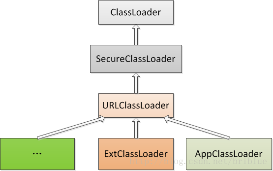

　例如：当jvm要加载Test.class的时候，

　　（1）首先会到自定义加载器中查找（其实是看运行时数据区的方法区有没有加载），看是否已经加载过，如果已经加载过，则返回字节码。

　　（2）如果自定义加载器没有加载过，则询问上一层加载器(即AppClassLoader)是否已经加载过Test.class。

　　（3）如果没有加载过，则询问上一层加载器（ExtClassLoader）是否已经加载过。

　　（4）如果没有加载过，则继续询问上一层加载（BoopStrap ClassLoader）是否已经加载过。

　　（5）如果BoopStrap ClassLoader依然没有加载过，则到自己指定类加载路径下（"sun.boot.class.path"）查看是否有Test.class字节码，有则返回，没有通

知下一层加载器ExtClassLoader到自己指定的类加载路径下（java.ext.dirs）查看。

　　（6）依次类推，最后到自定义类加载器指定的路径还没有找到Test.class字节码，则抛出异常ClassNotFoundException。

代码如下：


    protected Class<?> loadClass(String name, boolean resolve)
            throws ClassNotFoundException
        {
            synchronized (getClassLoadingLock(name)) {
                // 首先，检查是否已经加载过
                Class<?> c = findLoadedClass(name);
                if (c == null) {
                    long t0 = System.nanoTime();
                    try {
                        if (parent != null) {
                            //父加载器不为空,调用父加载器的loadClass
                            c = parent.loadClass(name, false);
                        } else {
                            //父加载器为空则,调用Bootstrap Classloader
                            c = findBootstrapClassOrNull(name);
                        }
                    } catch (ClassNotFoundException e) {
                        // ClassNotFoundException thrown if class not found
                        // from the non-null parent class loader
                    }
             if (c == null) {
                    // If still not found, then invoke findClass in order
                    // to find the class.
                    long t1 = System.nanoTime();
                    //父加载器没有找到，则调用findclass
                    c = findClass(name);
     
                    // this is the defining class loader; record the stats
                    sun.misc.PerfCounter.getParentDelegationTime().addTime(t1 - t0);
                    sun.misc.PerfCounter.getFindClassTime().addElapsedTimeFrom(t1);
                    sun.misc.PerfCounter.getFindClasses().increment();
                }
            }
            if (resolve) {
                //调用resolveClass()
                resolveClass(c);
            }
            return c;
        }
    }
​		为什么要使用这种加载方式呢？这里要注意几点，1，类加载器代码本身也是java类，因此类加载器本身也是要被加载的，因此显然必须有第一个类加载器不是Java类，这就是bootStrap，是使用c++写的其他这是java了。2，虽说bootStrap、extclassLoader、appclassloader三个是父子类加载器关系，但是并没有使用继承，而是使用了组合关系。3，优点，具备了一种带优先级的层次关系，越是基础的类，越是被上层的类加载器进行加载，可以比较笼统的说像jdk自带的几个jar包肯定是位于最顶级的，再就是我们引用的包，最后是我们自己写的，保证了java程序的稳定性。

19     jdk，jre，JVM的关系：JDK(Java Development Kit) 是 Java 语言的软件开发工具包(SDK)。在JDK的安装目录下有一个jre目录，里面有两个文件夹bin和lib，在这里可以认为bin里的就是jvm，lib中则是jvm工作所需要的类库，而jvm和 lib合起来就称为jre。

jdk，jre，JVM的关系图：

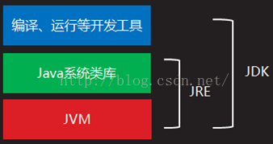

20，JVM运行简易过程：

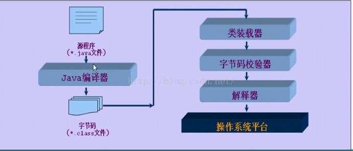

​		上图左半部分其实不是在JVM中，程序员在eclipse上写的是.java文件，经过编译成.class文件（比如maven工程需要maven install，打成jar报，jar包里面都是.calss文件）；这些步骤都是在eclipse上进行的。然后类加载器（classloader）一直到解释器是属于JVM的

##### 21，解释13中JVM结构图各模块的内容：

**程序计数器**（Program Counter Register）:也叫PC寄存器，是一块较小的内存空间，

1. 它可以看做是当前线程所执行的字节码的行号指示器。在虚拟机的概念模型里，字节码解释器工作时就是通过改变这个计数器的值来选取下一条需要执行的字节码指令、分支、循环、跳转、异常处理、线程恢复等基础功能都需要依赖这个计数器来完成。，   区别于计算机硬件的pc寄存器，两者不略有不同。计算机用pc寄存器来存放“伪指令”或地址，而相对于虚拟机，pc寄存器它表现为一块内存(一个字长，虚拟机要求字长最小为32位)，虚拟机的pc寄存器的功能也是存放伪指令，更确切的说存放的是将要执行指令的地址。

2.   当虚拟机正在执行的方法是一个本地（native）方法的时候，jvm的pc寄存器存储的值是undefined。（3）

3. 程序计数器是线程私有的，它的生命周期与线程相同，每个线程都有一个。（4）此内存区域是唯一一个在Java虚拟机规范中没有规定任何OutOfMemoryError情况的区域。

   

**Java虚拟机栈（Java Virtual Machine Stack）**：

1. 线程私有的，它的生命周期与线程相同，每个线程都有一个。
2. 每个线程创建的同时会创建一个JVM栈，JVM栈中每个栈帧存放的为当前线程中局部基本类型的变量（java中定义的八种基本类型：boolean、char、byte、short、int、long、float、double；和reference （32 位以内的数据类型，具体根据JVM位数（64为还是32位）有关，因为一个solt(槽）占用32位的内存空间 ）、部分的返回结果，非基本类型的对象在JVM栈上仅存放一个指向堆上的地址；
3. 每一个方法从被调用直至执行完成的过程就对应着一个栈帧在虚拟机栈中从入栈到出栈的过程。
4. 栈运行原理：栈中的数据都是以栈帧（Stack Frame）的格式存在，栈帧是一个内存区块，是一个数据集，是一个有关方法和运行期数据的数据集，当一个方法A被调用时就产生了一个栈帧F1，并被压入到栈中，A方法又调用了B方法，于是产生栈帧F2也被压入栈，B方法又调用了C方法，于是产生栈帧F3也被压入栈…… 依次执行完毕后，先弹出后进......F3栈帧，再弹出F2栈帧，再弹出F1栈帧。
5. JAVA虚拟机栈的最小单位可以理解为一个个栈帧，一个方法对应一个栈帧，一个栈帧可以执行很多指令，如


下图：

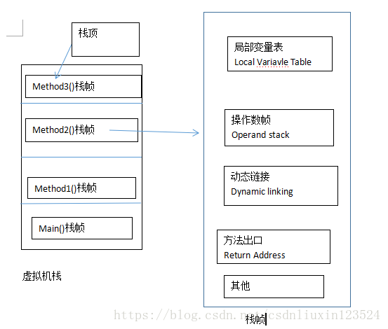

（7）对上图中的动态链接解释下，比如当出现main方法需要调用method1()方法的时候，操作指令就会触动这个动态链接就会找打方法区中对于的method1(),然后把method1()方法压入虚拟机栈中，执行method1栈帧的指令；此外如果指令表示的代码是个常量，这也是个动态链接，也会到方法区中的运行时常量池找到类加载时就专门存放变量的运行时常量池的数据。

**本地方法栈（Native Method Stack）**：

1.  先解释什么是本地方法：jvm中的本地方法是指方法的修饰符是带有native的但是方法体不是用java代码写的一类方法，这类方法存在的意义当然是填补java代码不方便实现的缺陷而提出的。案例介绍将在 下面22知识点仔细介绍。
2.   作用同java虚拟机栈类似，区别是：虚拟机栈为虚拟机执行Java方法服务，而本地方法栈则是为虚拟机使用到的Native方法服务。
3.  是线程私有的，它的生命周期与线程相同，每个线程都有一个。


**Java 堆（Java Heap）**：

1. 是Java虚拟机所管理的内存中最大的一块。
2. 不同于上面3个，堆是jvm所有线程共享的。
3. 在虚拟机启动的时候创建。
4. 唯一目的就是存放对象实例，几乎所有的对象实例以及数组都要在这里分配内存。
5. Java堆是垃圾收集器管理的主要区域。
6. 因此很多时候java堆也被称为“GC堆”（Garbage Collected Heap）。从内存回收的角度来看，由于现在收集器基本都采用分代收集算法，所以Java堆还可以细分为：新生代和老年代；新生代又可以分为：Eden 空间、From Survivor空间、To Survivor空间。（23知识点详细介绍）
7. java堆是计算机物理存储上不连续的、逻辑上是连续的，也是大小可调节的（通过-Xms和-Xmx控制）。
8. 如果在堆中没有内存完成实例的分配，并且堆也无法再扩展时，将会抛出OutOfMemoryError异常。

**方法区（Method Area）**：

1. 在虚拟机启动的时候创建。
2. 所有jvm线程共享。
3. 除了和堆一样不需要不连续的内存空间和可以固定大小或者可扩展外，还可以选择不实现垃圾收集。
4. 用于存放已被虚拟机加载的类信息、常量、静态变量、以及编译后的方法实现的二进制形式的机器指令集等数据。
5. 被装载的class的信息存储在Methodarea的内存中。当虚拟机装载某个类型时，它使用类装载器定位相应的class文件，然后读入这个class文件内容并把它传输到虚拟机中。
6. 运行时常量池（Runtime Constant Pool）是方法区的一部分。Class文件中除了有类的版本、字段、方法、接口等描述信息外，还有一项信息是常量池（Constant Pool Table），用于存放编译期生成的各种字面量和符号引用，这部分内容将在类加载后进入方法区的运行时常量池中存放。

> 方法区补充：指令集是个非常重要概念，因为程序员写的代码其实在jvm虚拟机中是被转成了一条条指令集执行的
>

**看下图**

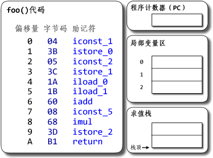

​		首先看看上面各部位位于13图中的那些位置：左侧的foo代码是指令集，可见就是在方法区，程序计数器就不用说了，局部变量区位于虚拟机栈中，右侧最下方的求值栈（也就是操作数栈）我们从动图中明显可以看出存在栈顶这个关键词因此也是位于java虚拟机栈的。

另外，图中，指令是Java代码经过javac编译后得到的JVM指令，PC寄存器指向下一条该执行的指令地址，局部变量区存储函数运行中产生的局部变量，栈存储计算的中间结果和最后结果。

上图的执行的源代码是：


    public class Demo {
        public static void foo() {
    
           int a = 1;
    
           int b = 2;
    
           int c = (a + b) * 5;
    
        }
     }


​		下面简单解释下执行过程，注意：偏移量的数字只是简单代表第几个指令哦，首先常数1入栈，栈顶元素就是1，然后栈顶元素移入局部变量区存储，常数2入栈，栈顶元素变为2，然后栈顶元素移入局部变量区存储；接着1，2依次再次入栈，弹出栈顶两个元素相加后结果入栈，将5入栈，栈顶两个元素弹出并相乘后结果入栈，然后栈顶变为15，最后移入局部变量。执行return命令如果当前线程对应的栈中没有了栈帧，这个Java栈也将会被JVM撤销。

**类加载器子系统（class loader subsystem）**：

(1)根据给定的全限定名类名(如java.lang.Object)来装载class文件的内容到Runtimedataarea中的methodarea(方法区域)。Java程序员可以extends java.lang.ClassLoader类来写自己的Classloader。

(2) 对（1）中的加载过程是：当一个classloader启动时，classloader的生存地点在jvm中的堆，然后它去主机硬盘上去装载A.class到jvm的methodarea(方法区),方法区中的这个字节文件会被虚拟机拿来new A字节码，然后在堆内存生成了一个A字节码的对象，然后A自己码这个内存文件有两个引用，一个指向A的class对象，一个指向加载自己的classloader。见下图：


 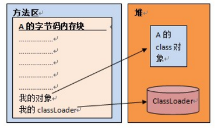

执行引擎（Executionengine子系统）：(1)负责执行来自类加载器子系统（class loader subsystem）中被加载类中在方法区包含的指令集，通俗讲就是类加载器子系统把代码逻辑（什么时候该if，什么时候该相加，相减）都以指令的形式加载到了方法区，执行引擎就负责执行这些指令就行了。

用网上最流行的一张图表示就是：


 

(1)程序在JVM主要执行的过程是执行引擎与运行时数据区不断交互的过程，可理解为上面“方法区中的动图” （2）但是执行引擎拿到的方法区中的指令还是人能够看懂的，这里执行引擎的工作就是要把指令转成JVM执行的语言（也可以理解成操作系统的语言），最后操作系统语言再转成计算机机器码。

 

解释器：一条一条地读取，解释并且执行字节码指令。因为它一条一条地解释和执行指令，所以它可以很快地解释字节码，但是执行起来会比较慢。这是解释执行的语言的一个缺点。字节码这种“语言”基本来说是解释执行的。
即时(Just-In-Time)编译器：即时编译器被引入用来弥补解释器的缺点。执行引擎首先按照解释执行的方式来执行，然后在合适的时候，即时编译器把整段字节码编译成本地代码。然后，执行引擎就没有必要再去解释执行方法了，它可以直接通过本地代码去执行它。执行本地代码比一条一条进行解释执行的速度快很多。编译后的代码可以执行的很快，因为本地代码是保存在缓存里的。
上面也是才能够别处拷来的，是对上图的解释，这里的字节码解释器也就对应20中的解释器。简单理解jit就是当代码中某些方法复用次数比较高的，并超过一个特定的值就成为了“热点代码”。那么这个这些热点代码就会被编译成本地代码（其实可以理解成缓存）加快访问速度。

##### 22，本地（native）方法讲解：

1.  本地方法就是带有native标识符修饰的方法；（2）native修饰符修饰的方法并不提供方法体，但因为其实现体是由非java代码在在外部实现的，因此不能与abstract连用；（3）存在的意义：不方便用java语言写的代码，使用更为专业的语言写更合适；甚至有些JVM的实现就是用c编写的，所以只能使用c来写，

2.  更多的本地方法最好是与jdk的执行引擎的解释器语言一致（执行引擎、解释器：参考21的执行引擎）；

3.  Windows、Linux、UNIX、Dos操作系统的核心代码大部分是使用C和C＋＋编写，底层接口用汇编编写．

4.  为什么native方法修饰的修饰的方法PC程序计数器为undefined。读懂上面的所有知识点可以就很容易自己理解了。在一开始类加载时，native修饰的方法就被保存在了本地方法栈中，当需要调用native方法时，调用的是一个指向本地方法栈中某方法的地址，然后执行方法直接与操作系统交互，返回运行结果。整个过程并没有经过执行引擎的解释器把字节码解释成操作系统语言，PC计数器也就没有起作用。


23，GC垃圾回收机制：

了解堆内存：

类加载器读取了类文件后，需要把类、方法、常变量放到堆内存中，以方便执行器执行，堆内存分为三部分：

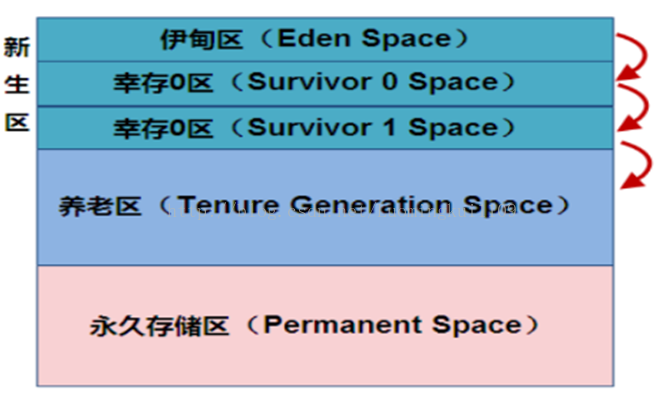

   ① **新生区**

   	新生区是类的诞生、成长、消亡的区域，一个类在这里产生，应用，最后被垃圾回收器收集，结束生命。新生区又分为两部分：伊甸区（Eden space）和幸存者区（Survivor pace），所有的类都是在伊甸区被new出来的。幸存区有两个：0区（Survivor 0 space）和1区（Survivor 1 space）。当伊甸园的空间用完时，程序又需要创建对象，JVM的垃圾回收器将对伊甸园进行垃圾回收（Minor GC）,将伊甸园中的剩余对象移动到幸存0区。若幸存0区也满了，再对该区进行垃圾回收，然后移动到1区。那如果1去也满了呢？再移动到养老区。若养老区也满了，那么这个时候将产生Major GC（FullGCC），进行养老区的内存清理。若养老区执行Full GC 之后发现依然无法进行对象的保存，就会产生OOM异常“OutOfMemoryError”。

 如果出现java.lang.OutOfMemoryError: Java heap space异常，说明Java虚拟机的堆内存不够。原因有二：

a.Java虚拟机的堆内存设置不够，可以通过参数-Xms、-Xmx来调整。

 b.代码中创建了大量大对象，并且长时间不能被垃圾收集器收集（存在被引用）。

 ② **养老区**

     养老区用于保存从新生区筛选出来的 JAVA 对象，一般池对象都在这个区域活跃。

 ③ **永久区**

     永久存储区是一个常驻内存区域，用于存放JDK自身所携带的 Class,Interface 的元数据，也就是说它存储的是运行环境必须的类信息，被装载进此区域的数据是不会被垃圾回收器回收掉的，关闭 JVM 才会释放此区域所占用的内存。

​		 如果出现java.lang.OutOfMemoryError: PermGen space，说明是Java虚拟机对永久代Perm内存设置不够。原因有二：

>  a. 程序启动需要加载大量的第三方jar包。例如：在一个Tomcat下部署了太多的应用。
>
>  b. 大量动态反射生成的类不断被加载，最终导致Perm区被占满。
>

 **说明：**

>  Jdk1.6及之前：常量池分配在永久代 。
>
>  Jdk1.7：有，但已经逐步“去永久代” 。
>

 Jdk1.8及之后：无(java.lang.OutOfMemoryError: PermGen space,这种错误将不会出现在JDK1.8中)。

 

首先要执行的代码是：

先执行main方法：


当要调用其他方法时：

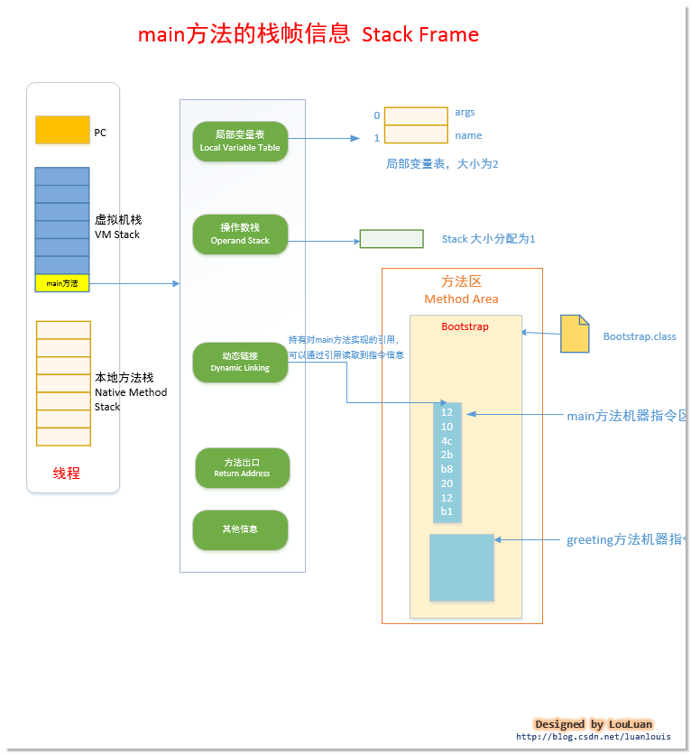

当要调用其他方法时：

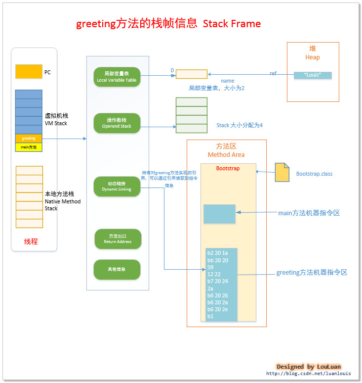

25，java代码编译（Java　Compiler）过程，也就是由.java文件到.class文件的过程（附上网上很流行的图，个人感觉没必要记，反正我是记不住）


注：源代码就是.java文件，JVM字节码就是.class文件

27，是先加载字节码文件还是先执行main方法：先加载字节码文件到方法区，然后在找到main执行程序。

28，java被编译成了class文件，JVM怎么从硬盘上找到这个文件并装载到JVM里呢？

是通过java本地接口（JNI），找到class文件后并装载进JVM，然后找到main方法，最后执行。

29，我们平时所说的八大基本类型的在栈中的存放位置是：运行时数据区--》虚拟机栈--》虚拟机栈的一个栈帧--》栈帧中的局部变量表；局部变量表存放的数据除了八大基本类型外，还可以存放一个局部变量表的容量的最小单位变量槽（slot）的大小，通常表示为reference;所以是可以放字符串类型的，但是要以 String a="aa";的形式出现，如果是new Object()那就只能实在哎堆中了，栈里面存的是栈执行堆的地址。

30，堆内存大小-Xms -Xmx设置相同，因为-Xmx越大tomcat就有更多的内存可以使用，这就意味着JVM调用垃圾回收机制的频率就会减少（垃圾回收机制被调用是jvm内存不够时自动调用的）可以避免每次垃圾回收完成后JVM重新分配内存。

31，GC具体什么时候执行，这个是由系统来进行决定的，是无法预测的。

32，方法区也被成为堆内存中的永久代，看下面例子：

```
Student s = new Student("小明"，18);

s 是指针，存放在栈中。

new Student("小明"，18) 是对象 ，存放在堆中。

Student 类的信息存放在方法区。
```

总结 ：

​		对象的实例保存在堆上，对象的元数据（instantKlass）保存在方法区，对象的引用保存在栈上。
类加载是会先看方法区有没有已经加载过这个类，因此方法区中的类是唯一的。方法区中的类都是运行时的，都是正在使用的，是不能被GC的，所以可以理解成永久代。

##### 33，java 内存模型

读完上面那么多最后一个知识点，理解下多线程的一点知识。我们应该知道了在运行时数据内存区中虚拟机栈、pc寄存器、本地方法栈是每个线程都有的，很明显这些都是独立的不会发生线程不安全的问题，但是我们平时讨论的线程不安全、要加锁等等情况是怎么回事呢？

其实，发生线程不安全问题的原因在于cpu，看下图，简单理解cpu

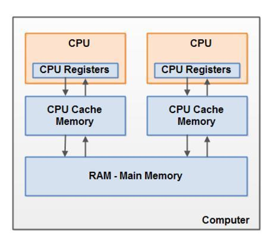

​		在CPU内部有一组CPU寄存器，也就是CPU的储存器。CPU操作寄存器的速度要比操作计算机主存快的多。在主存和CPU寄存器之间还存在一个CPU缓存，CPU操作CPU缓存的速度快于主存但慢于CPU寄存器。某些CPU可能有多个缓存层（一级缓存和二级缓存）。计算机的主存也称作RAM，所有的CPU都能够访问主存，而且主存比上面提到的缓存和寄存器大很多。
​		**当一个CPU需要访问主存时，会先读取一部分主存数据到CPU缓存，进而在读取CPU缓存到寄存器。当CPU需要写数据到主存时，同样会先flush寄存器到CPU缓存，然后再在某些节点把缓存数据flush到主存。**

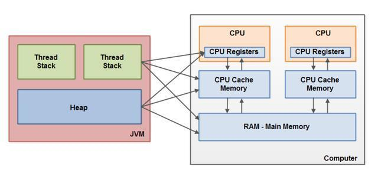

Java内存模型和硬件架构之间的桥接
正如上面讲到的，Java内存模型和硬件内存架构并不一致。硬件内存架构中并没有区分栈和堆，从硬件上看，不管是栈还是堆，大部分数据都会存到主存中，当然一部分栈和堆的数据也有可能会存到CPU寄存器中，如下图所示，Java内存模型和计算机硬件内存架构是一个交叉关系：


当对象和变量存储到计算机的各个内存区域时，必然会面临一些问题，其中最主要的两个问题是：

> 1. **共享对象对各个线程的可见性**
> 2. **共享对象的竞争现象**

> **问题1**：

**共享对象的可见性**
当多个线程同时操作同一个共享对象时，如果没有合理的使用volatile和synchronization关键字，一个线程对共享对象的更新有可能导致其它线程不可见。

想象一下我们的共享对象存储在主存，一个CPU中的线程读取主存数据到CPU缓存，然后对共享对象做了更改，但CPU缓存中的更改后的对象还没有flush到主存，此时线程对共享对象的更改对其它CPU中的线程是不可见的。最终就是每个线程最终都会拷贝共享对象，而且拷贝的对象位于不同的CPU缓存中。

下图展示了上面描述的过程。左边CPU中运行的线程从主存中拷贝共享对象obj到它的CPU缓存，把对象obj的count变量改为2。但这个变更对运行在右边CPU中的线程不可见，因为这个更改还没有flush到主存中：

 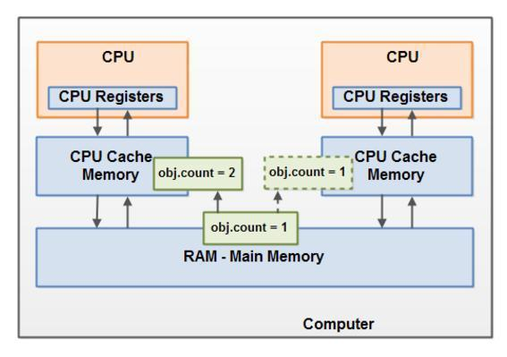


 

要解决共享对象可见性这个问题，我们可以使用java volatile关键字。 Java’s volatile keyword. volatile 关键字可以保证变量会直接从主存读取，而对变量的更新也会直接写到主存。volatile原理是基于CPU内存屏障指令实现的。

> **问题2：**

**竞争现象**
如果多个线程共享一个对象，如果它们同时修改这个共享对象，这就产生了竞争现象。
如下图所示，线程A和线程B共享一个对象obj。假设线程A从主存读取Obj.count变量到自己的CPU缓存，同时，线程B也读取了Obj.count变量到它的CPU缓存，并且这两个线程都对Obj.count做了加1操作。此时，Obj.count加1操作被执行了两次，不过都在不同的CPU缓存中。

如果这两个加1操作是串行执行的，那么Obj.count变量便会在原始值上加2，最终主存中的Obj.count的值会是3。然而下图中两个加1操作是并行的，不管是线程A还是线程B先flush计算结果到主存，最终主存中的Obj.count只会增加1次变成2，尽管一共有两次加1操作。

 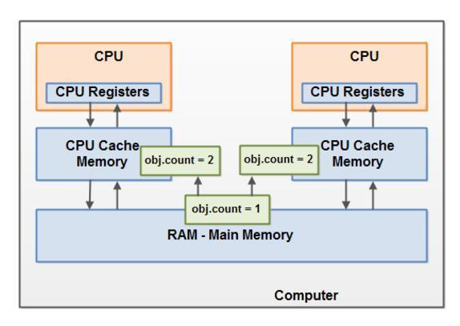


​		要解决上面的问题我们可以使用java synchronized代码块。synchronized代码块可以保证同一个时刻只能有一个线程进入代码竞争区，synchronized代码块也能保证代码块中所有变量都将会从主存中读，当线程退出代码块时，对所有变量的更新将会flush到主存，不管这些变量是不是volatile类型的。

1. **volatile和 synchronized区别**
   volatile本质是在告诉jvm当前变量在寄存器（工作内存）中的值是不确定的，需要从主存中读取； synchronized则是锁定当前变量，只有当前线程可以访问该变量，其他线程被阻塞住。

   

2. volatile仅能使用在变量级别；synchronized则可以使用在变量、方法、和类级别的
   volatile仅能实现变量的修改可见性，不能保证原子性；而synchronized则可以保证变量的修改可见性和原子性

   

3. volatile不会造成线程的阻塞；synchronized可能会造成线程的阻塞。
   volatile标记的变量不会被编译器优化；synchronized标记的变量可以被编译器优化
   支撑Java内存模型的基础原理

 

##### 34，方法区与堆的区别

​		方法区存放了类的信息，有类的静态变量、final类型变量、field自动信息、方法信息，处理逻辑的指令集，我们仔细想想一个类里面也就这些东西，而堆中存放是对象和数组，咋一看好像方法区跟堆的作用是一样的。其实呢

> 1，这里就关系到我们平时说的对象是类的实例，是不是有点恍然大悟了？这里的对应关系就是 “方法区--类”  “堆--对象”，以“人”为例就是，堆里面放的是你这个“实实在在的人，有血有肉的”，而方法区中存放的是描述你的文字信息，如“你的名字，身高，体重，还有你的行为，如吃饭，走路等”。
>
> 2，再者我们从另一个角度理解，就是从前我们得知方法区中的类是唯一的，同步的。但是我们在代码中往往同一个类会new几次，也就是有多个实例，既然有多个实例，那么在堆中就会分配多个实例空间内存。

 

 

##### 36，方法区，栈、堆之间的过程

​		类加载器加载的类信息放到方法区，--》执行程序后，方法区的方法压如栈的栈顶--》栈执行压入栈顶的方法--》遇到new对象的情况就在堆中开辟这个类的实例空间。（这里栈是有此对象在堆中的地址的）
